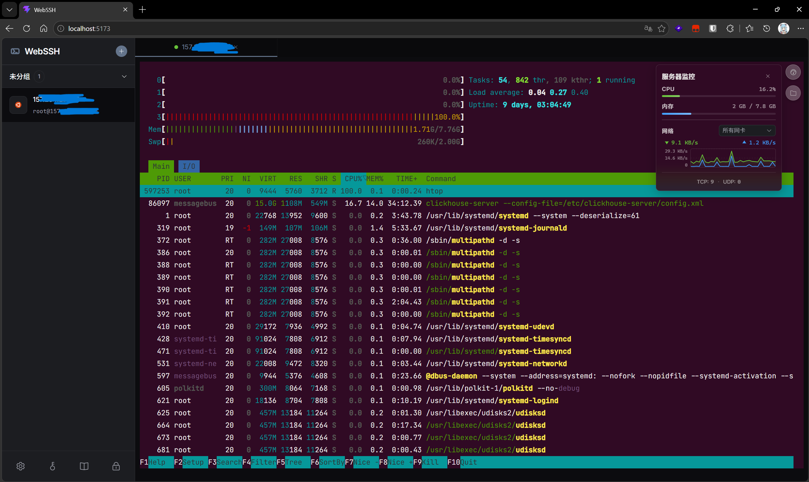

<h1 align="center">WebSSH</h1>

<p align="center">
  <a href="#简体中文">简体中文</a> | <a href="#english">English</a>
</p>

<p align="center">
  <a href="https://github.com/Iruko233/WebSSH/blob/master/LICENSE"></a>
  
  
  
</p>

<p align="center">
  
</p>

---

<h2 id="简体中文">简体中文</h2>

基于浏览器端 Go WASM 的零知识 Web SSH 管理工具，所有服务器凭据在浏览器内 AES-256-GCM 加密后上传，服务端仅存密文，主密码永不离开浏览器，单用户，仅需主密码

### 目录 (Table of Contents)
- [特性 (Features)](#特性-features)
- [快速开始 (Quick Start)](#快速开始-quick-start)
- [数据迁移与导入 (Data Migration)](#数据迁移与导入-data-migration)
- [开发与源码编译 (Development)](#开发与源码编译-development)
- [安全架构 (Security Architecture)](#安全架构-security-architecture)

---

### 特性 (Features)

- **零知识存储**：服务器凭据在浏览器端 AES-256-GCM 加密，服务端仅存密文
- **浏览器端 SSH**：Go WASM 在浏览器内完成完整的 SSH 握手与会话加密，后端无法接触明文凭据或会话内容
- **透明 TCP 代理**：后端仅做原始二进制流转发（WebSocket ↔ TCP），对 SSH 协议零感知
- **内置 SFTP 与监控**：文件管理与系统资源监控（CPU/内存/网络流速）全部通过 WASM SSH 客户端执行
- **单密码认证**：无需用户名，一个主密码解锁一切
- **可自定义加密强度**：标准 / 高 / 偏执 三档 + 自定义
- **密码不落盘**：密钥仅存 sessionStorage，关浏览器即失效
- **部署灵活**：既可以本地运行当作普通的 SSH 客户端，也可以部署在 NAS 或服务器上作为 Web 跳板机，方便在浏览器随时随地管理服务器
- **单二进制部署**：前端内嵌，一个文件即可运行
- **移动端适配**：包含专为手机优化的带 Ctrl/Alt 组合键的虚拟键盘
- **浏览器终端**：基于 xterm.js

---

### 快速开始 (Quick Start)

本项目支持完全的**单文件运行**模式，前端已内嵌于后端程序中

1. **下载程序**：前往 [GitHub Releases](https://github.com/Iruko233/WebSSH/releases) 下载对应操作系统和架构的最新预编译二进制文件
2. **直接运行**：无需任何依赖，直接双击或在终端执行该文件
   ```bash
   ./webssh-linux-amd64
   ```
   程序启动后，数据会自动保存在运行目录下的 `./data/webssh.db` 中
3. **高级启动参数**：
   ```bash
   # 自定义端口运行 (默认 8022)
   ./webssh -port 9000
   
   # 运维内网机器 (解除 SSRF 保护，允许连接私有 IP)
   ./webssh -allow-private-ips
   ```

---

### 数据迁移与导入 (Data Migration)

为了方便你从其他终端工具 (如 Xshell, Termius) 迁移数据，系统内置了 JSON 批量导入功能，你只需要按照以下 JSON 格式准备好数据文件，点击 WebSSH 左上角的 `...` 菜单并选择 **导入配置** 即可，系统会自动处理重名和同 IP 的冲突（你可以自由选择覆盖或跳过）

**最简示例**：
```json
{
  "version": 1,
  "servers": [
    {
      "host": "192.168.1.100",
      "username": "root"
    }
  ]
}
```

**字段说明**：
- `version`: 请固定填写 `1`
- `host`, `username`: 🔴 **必填字段**，建立连接的基础信息
- `password`: ⚪ 选填，服务器密码
- `port`: ⚪ 选填，未填写则默认为 `22`
- `name`: ⚪ 选填，未填写则默认展示为 `host` IP
- `group`: ⚪ 选填，用于服务器分组归类
- `tags`: ⚪ 选填，字符串数组 (如 `["prod", "web"]`)，用于标记机器属性
- 导入操作完全在前端内存中进行并自动加密，**不会有任何明文上传至服务器**

---

### 开发与源码编译 (Development)

#### 开发模式
开发模式下，前端 Vite 会提供热更新功能，并将 API 请求自动代理到后端
```bash
# 终端 1：启动后端（:8022）
cd backend && go run ./cmd/server

# 终端 2：启动前端（:5173）
cd frontend && npm install && npm run dev
```

#### 本地编译构建
如果你想从源码编译单二进制文件，可以使用跨平台的 PowerShell 脚本（会自动编译前端并内嵌到 Go 后端中）：
```powershell
# 编译全部支持的平台 (Windows/Linux/macOS)
./build.ps1

# 只构建指定平台
./build.ps1 -Targets "windows/amd64", "linux/arm64"

# 跳过前端构建（仅重新编译后端）
./build.ps1 -SkipFrontend
```
_注：项目通过 GitHub Actions 实现自动化发布，向主分支推送 `v*.*.*` 的 Tag 即可触发云端自动构建发布_

---

### 安全架构 (Security Architecture)

#### 1. 静态数据加密 (Data at Rest)
- **浏览器端加密**：所有服务器凭据（密码/私钥）在发送给后端前，都会在浏览器中使用基于“主密码”派生的 AES-256-GCM 密钥进行加密
- **后端只存密文**：Go 后端数据库中只保存加密后的凭据密文，不保存主密码或任何明文凭据
- **防拖库**：如果 `webssh.db` 数据库文件被窃取，没有主密码的情况下，攻击者无法解密服务器凭据
- **密码丢失 = 数据永久不可恢复**

#### 2. 通信加密 (Data in Transit)
- **SSH 协议原生端到端加密**：SSH 握手与加密全部在浏览器端 Go WASM 中完成，加密隧道从浏览器直达目标服务器，后端透明代理无法窥探 SSH 会话内容
- **API 数据传输加密**：从后端获取服务器列表和配置时，核心凭据字段已经是 AES-256-GCM 加密状态，即使网络流量被截获，也无法获得明文凭据
- **WebSocket 原始二进制流**：浏览器与后端之间通过 WebSocket 建立二进制流隧道，所有 SSH 协议数据（已是加密状态）作为不透明字节流在此隧道中传输，后端对 SSH 协议零感知，仅做 TCP 转发
- **建议启用 HTTPS/WSS**：生产环境应配置 TLS 证书以保护 WebSocket 连接的完整性与机密性，并防止中间人篡改 WASM 二进制文件

#### 3. 安全边界与局限 (Security Boundaries & Limitations)
本系统采用"浏览器端 WASM SSH + 后端透明 TCP 代理"架构，后端无法接触 SSH 凭据明文与会话内容，但以下局限性依然存在：
- **高度依赖主密码强度**：后端仅存密文，一旦 `webssh.db` 数据库泄露，攻击者可在本地无限制暴力破解，系统使用 PBKDF2-SHA512 / Argon2id 进行密钥派生（KDF）以增加破解成本，但弱密码仍可能被破解
- **后端可观测元数据**：透明代理转发原始 TCP 字节流，虽然无法解密 SSH 会话内容，但可观测到连接目标 IP、端口、连接时长、流量模式等元数据，部署时应确保后端运行环境受信任
- **WASM 二进制完整性至关重要**：`/main.wasm` 文件包含完整的 SSH 客户端逻辑（凭据处理、密钥交换、会话加密），如果攻击者能够替换或篡改服务端的 WASM 文件（例如通过入侵部署服务器），则可在浏览器中窃取所有凭据与会话内容，务必通过 HTTPS 部署并保护构建与发布流程

---

<h2 id="english">English</h2>

A zero-knowledge Web SSH management tool based on browser-side Go WASM, all server credentials are encrypted with AES-256-GCM in the browser before being uploaded, the server only stores ciphertext, and the master password never leaves the browser, single user, requires only a master password

### Table of Contents
- [Features](#features)
- [Quick Start](#quick-start)
- [Data Migration & Import](#data-migration--import)
- [Development & Build](#development--build)
- [Security Architecture](#security-architecture)

---

### Features

- **Zero-Knowledge Storage**: Server credentials are AES-256-GCM encrypted in the browser, the server only stores ciphertext
- **Browser-Side SSH**: Go WASM completes the full SSH handshake and session encryption in the browser, the backend cannot access plaintext credentials or session content
- **Transparent TCP Proxy**: The backend only forwards raw binary streams (WebSocket ↔ TCP), with zero awareness of the SSH protocol
- **Built-in SFTP and Monitoring**: File management and system resource monitoring (CPU/memory/network speed) are all executed via the WASM SSH client
- **Single Password Authentication**: No username required, a single master password unlocks everything
- **Customizable Encryption Strength**: Standard / High / Paranoid tiers + Custom
- **Password Never Touches Disk**: Keys are only stored in sessionStorage, becoming invalid as soon as the browser is closed
- **Flexible Use Cases**: Run it locally as a regular SSH client, or deploy it on a NAS or server as a Web jump server to access your machines remotely from any browser
- **Single Binary Deployment**: Frontend is embedded, runs from a single file
- **Mobile Friendly**: Includes a virtual keyboard optimized for mobile with Ctrl/Alt modifier keys
- **Browser Terminal**: Based on xterm.js

---

### Quick Start

This project supports **single-file deployment** out of the box, with the frontend embedded into the backend executable

1. **Download**: Go to [GitHub Releases](https://github.com/Iruko233/WebSSH/releases) and download the latest pre-compiled binary for your OS and architecture
2. **Run**: No dependencies required, just execute the file
   ```bash
   ./webssh-linux-amd64
   ```
   All data will be saved automatically to `./data/webssh.db` in the working directory
3. **Advanced Arguments**:
   ```bash
   # Run on a custom port (default 8022):
   ./webssh -port 9000
   
   # Manage internal network machines (disables SSRF protection, allows private IP connections):
   ./webssh -allow-private-ips
   ```

---

### Data Migration & Import

To easily migrate your servers from other clients (like Xshell or Termius), WebSSH supports batch importing via JSON, prepare your server configurations matching the JSON schema below, open the `...` menu on the top left of the dashboard, and select **Import Configuration**, the system will intelligently handle conflicts (allowing you to Overwrite or Skip)

**Minimal Example**:
```json
{
  "version": 1,
  "servers": [
    {
      "host": "192.168.1.100",
      "username": "root"
    }
  ]
}
```

**Fields Guide**:
- `version`: Must be `1`
- `host`, `username`: 🔴 **Required fields** for the SSH connection
- `password`: ⚪ Optional, server password
- `port`: ⚪ Optional, defaults to `22` if omitted
- `name`: ⚪ Optional, defaults to the `host` IP if omitted
- `group`: ⚪ Optional, used to group servers
- `tags`: ⚪ Optional, array of strings (e.g. `["prod", "web"]`), used to tag servers
- The import process runs entirely in your browser's memory and encrypts everything locally, **no plaintext data is ever sent to the server**

---

### Development & Build

#### Development Mode
In development mode, the frontend Vite provides hot reloading and automatically proxies API requests to the backend
```bash
# Terminal 1: Start backend (:8022)
cd backend && go run ./cmd/server

# Terminal 2: Start frontend (:5173)
cd frontend && npm install && npm run dev
```

#### Local Compilation
If you want to compile the single binary locally from source, you can use our cross-platform PowerShell script (it automatically builds the frontend and embeds it into the Go backend):
```powershell
# Compile for all platforms (Windows/Linux/macOS)
./build.ps1

# Build only specified platforms
./build.ps1 -Targets "windows/amd64", "linux/arm64"

# Skip frontend build (recompile backend only)
./build.ps1 -SkipFrontend
```
_Note: The project uses GitHub Actions for automated releases, pushing a tag starting with `v` (e.g. `v1.0.0`) automatically builds and publishes binaries_

---

### Security Architecture

#### 1. Data at Rest
- **Browser-Side Encryption**: All server credentials (passwords/private keys) are encrypted in the browser using an AES-256-GCM key derived from the "master password" before being sent to the backend
- **Backend Only Stores Ciphertext**: The Go backend database only stores the encrypted credential ciphertext, and does not store the master password or any plaintext credentials
- **Anti-Database Dumping**: If the `webssh.db` database file is stolen, attackers cannot decrypt the server credentials without the master password
- **Lost Password = Data Permanently Irrecoverable**

#### 2. Data in Transit
- **SSH Protocol Native End-to-End Encryption**: The SSH handshake and encryption are entirely completed in the browser-side Go WASM, creating an encrypted tunnel directly from the browser to the target server, the backend transparent proxy cannot pry into the SSH session content
- **API Data Transmission Encryption**: When fetching the server list and configurations from the backend, the core credential fields are already in an AES-256-GCM encrypted state, even if network traffic is intercepted, plaintext credentials cannot be obtained
- **WebSocket Raw Binary Stream**: A binary stream tunnel is established between the browser and the backend via WebSocket, all SSH protocol data (already encrypted) is transmitted within this tunnel as an opaque byte stream, the backend has zero awareness of the SSH protocol and only acts as a TCP forwarder
- **HTTPS/WSS Highly Recommended**: Production environments should be configured with TLS certificates to protect the integrity and confidentiality of the WebSocket connection, and to prevent man-in-the-middle attacks from tampering with the WASM binary file

#### 3. Security Boundaries & Limitations
This system uses a "browser-side WASM SSH + backend transparent TCP proxy" architecture, where the backend cannot access plaintext SSH credentials and session content, however, the following limitations still exist:
- **Highly Dependent on Master Password Strength**: The backend only stores ciphertext, so if the `webssh.db` database leaks, attackers can perform unlimited offline brute-force attacks locally, the system uses PBKDF2-SHA512 / Argon2id for key derivation (KDF) to increase cracking costs, but weak passwords can still be cracked
- **Backend Observable Metadata**: The transparent proxy forwards raw TCP byte streams, although it cannot decrypt SSH session content, it can observe metadata such as target IP, port, connection duration, and traffic patterns, ensure the backend running environment is trusted when deploying
- **WASM Binary Integrity is Critical**: The `/main.wasm` file contains the complete SSH client logic (credential handling, key exchange, session encryption), if an attacker can replace or tamper with the server-side WASM file (e.g., by compromising the deployment server), they can steal all credentials and session content in the browser, it is imperative to deploy via HTTPS and protect the build and release pipelines
